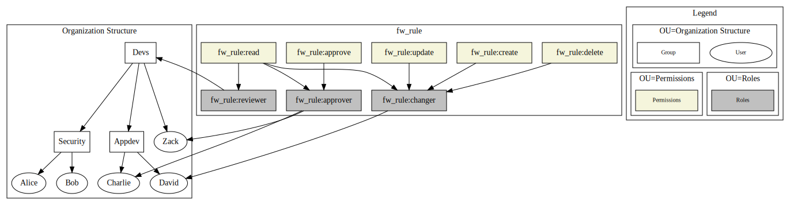

# Integrating Keycloak with AD

## Provisioning

```
vagrant up
```

After it's up, we have to add AD DS

```
./vagrant-ssh.sh -c 'C:\vagrant\provision-00-adds.ps1'
```

And then Windows will automatically reboot, then we add users and groups

```
./vagrant-ssh.sh -c 'C:\vagrant\provision-01-add-users-groups.ps1'
```

The provisioned users have this structure



## Adding User Federation in Keycloak

1. Go to User Federation
2. Select LDAP
3. Add settings according to [user-federation-provider-config.json](./user-federation-provider-config.json)
4. Save settings
5. Change username mapper, to map to the LDAP Attribute `sAMAccountName`
6. Switch back to ad-ds settings, click "Synchronize all users" - you should import 5 users.
7. Test signing in to keycloak with

```
userthree@vdom.local
P@ssword123
```

> I believe only the fields in Mappers are pulled, so add mappers for each
>   field you need pulled into Keycloak

Add group and role mappings according to [user-federation-provider-config.json](./user-federation-provider-config.json)

## SSH into the container

Get powershell

```
./vagrant-ssh.sh -c powershell
```

Get cmd

```
./vagrant-ssh.sh -c powershell
```

## Tips/Notes

Quick test using ldapsearch

```
ldapsearch -x -o ldif-wrap=no -h localhost -p 3389 -D 'userzero@vdom.local' -w 'P@ssword123' -b 'dc=vdom,dc=local'
```

Show all groups

```
ldapsearch -x -o ldif-wrap=no -h localhost -p 3389 -D 'userzero@vdom.local' -w 'P@ssword123' -b 'dc=vdom,dc=local' '(objectClass=group)'
```

List all users we created

```
ldapsearch -x -o ldif-wrap=no -h localhost -p 3389 -D 'userzero@vdom.local' -w 'P@ssword123' -b 'dc=vdom,dc=local' '(userPrincipalName=*vdom.local)'
```
